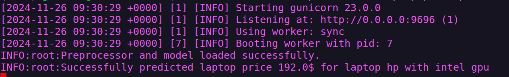

# Laptops & Netbooks Price Prediction


## Installation

1. Clone the Repository:
    ```bash
    git clone git@github.com:jxareas/Laptop-Price-Prediction-Midterm.git
    ```

2. Activate the virtual environment
    ```bash
    python -m venv venv
    source venv/bin/activate  # windows -> venv\Scripts\activate
    ```

3. Install all dependencies using pip

    ```bash
    pip install -r requirements.txt
    ```

## Problem Description

In this project, we tackle the problem of predicting the price of laptops and netbooks listed on eBay using a dataset
extracted from the website. The dataset contains a variety of features, including laptop specifications, ratings, seller
information, and more. By training a machine learning model on this dataset, we aim to predict the price of a laptop
based on its features, such as brand, processor type, screen size, RAM, SSD capacity, and other relevant attributes.

The target variable in this problem is the **Price** of the laptop, and our objective is to create a regression model
that can accurately predict this value based on the input features. The solution will be useful for eBay sellers and
buyers alike, as it will provide insights into how the features of a laptop affect its price, helping to guide sellers
in setting competitive prices and buyers in evaluating fair prices for products.

### Dataset Description

The dataset contains the following features:

- **Brand**: The manufacturer or company that produces the laptop.
- **Price**: The cost of the laptop as listed on eBay (target variable).
- **Rating**: The overall rating or feedback score given by previous buyers.
- **Ratings Count**: The number of ratings or reviews received for the laptop.
- **Condition**: The state of the laptop (e.g., new, used, refurbished).
- **Seller Note**: Additional information or notes provided by the seller.
- **Processor**: The central processing unit (CPU) powering the laptop.
- **Screen Size**: The diagonal measurement of the laptop screen in inches.
- **Manufacturer Color**: The color specified by the laptop manufacturer.
- **Color**: The actual color of the laptop as listed by the seller.
- **Ram Size**: The amount of random access memory (RAM) in the laptop.
- **SSD Capacity**: The storage capacity of the solid-state drive (SSD).
- **GPU**: The graphics processing unit responsible for rendering images and videos.
- **Processor Speed**: The clock speed of the processor, usually measured in GHz.
- **Type**: The type of laptop (e.g., notebook, ultrabook, 2-in-1).
- **Release Year**: The year the laptop model was released.
- **Maximum Resolution**: The highest display resolution supported by the laptop.
- **Model**: The specific model name or number of the laptop.
- **OS**: The operating system installed on the laptop (e.g., Windows, macOS, Linux).
- **Features**: Additional functionalities or specifications of the laptop.
- **Hard Drive Capacity**: The storage capacity of the traditional hard disk drive (HDD).
- **Country Region Of Manufacturer**: The country where the laptop was manufactured.
- **Storage Type**: The type of storage technology used (e.g., HDD, SSD, hybrid).

### Problem Objective

The goal of this project is to predict the price of laptops based on their various features. This will be accomplished
by applying traditional supervised machine learning techniques such as Generalized Linear Models (GLMs), tree-based
models and ensemble models. The best-performing model will be selected through hyperparameter tuning and evaluation
based on appropriate regression metrics.

### Usage of Solution

Once the machine learning model is trained and deployed, it can be used to predict the price of laptops for new listings
on eBay. This can help sellers price their laptops appropriately and can assist buyers in determining the expected price
range for different types of laptops.

The solution can be further extended to predict other variables, such as the laptop's rating or the number of reviews,
and can be integrated into eBay's pricing tools or third-party price comparison websites. Furthermore, we might even
go as far to perform a similar process with other e-commerce sites (such as Amazon).

## Containerization

### Building the image

We can build the docker image for the Flask API of this project by doing:

```bash
docker build -t laptop-price-prediction .
```

Containers package the application along with all its dependencies and configurations, ensuring that the app runs
consistently across different environments, whether it's a local machine, staging, or production server.

### Creating and running the container

The following command starts a Docker container based on the `laptop-price-prediction:latest` image, 
running it interactively (`-it`), removes the container after it stops (`--rm`), and maps port `9696` on the host 
to port `9696` inside the container. 
This setup is typically used to run a service, like a web API, from the container while keeping the terminal
session open for interaction.

```bash
docker run -it --rm -p 9696:9696 laptop-price-prediction:latest
```


## Testing the deployment

Run `predict_test.py` with either a local server (by running the `predict.py` python script) or the Docker 
container with `docker run -it --rm -p 9696:9696 hypertension-prediction:latest`.


